# 1999 · 样品清单（首批实物）

首批实物逐件清单 + 商品图,**按品类归类**。数据源:分销商「WANT想要珠宝」销售明细单 **XS260809003**(2026-08-09) + **出库单**(2026-08-10,裸石 4 颗,客户任总),均为官方单据。

| 汇总 | 数值 |
|---|---|
| 件数 | **21 件**(成品 17 + 裸石 4) |
| 进货合计 | **¥54,359 RMB**(成品 ¥52,608 + 裸石 ¥1,751)≈ R$40,800 ≈ $7,540(未含运费/巴西进口税) |
| 成品主石 | 17.69ct / 14 颗(满钻排戒 3 枚无中心主石) |
| 裸石 | 2.16ct / 4 颗(圆形,未镶嵌) |
| 副石 | 5.989ct / 339 粒 |

### 品类小计

| 品类 | 件数 | 进货小计¥ |
|---|---|---|
| 裸石 | 4 | 1,751 |
| 基础款戒指 | 7 | 17,462 |
| 设计款戒指 | 8 | 31,889 |
| 耳饰 | 0 | — |
| 手链 | 0 | — |
| 吊坠 | 2 | 3,257 |
| **合计** | **21** | **54,359** |

> 🖼 **图片怎么放**:每款 **3 张已批准标准角度**(`-1` 三分之一侧角 / `-2` 正面 / `-3` 正侧面),存成 `docs/images/<条码>-1.png`、`-2.png`、`-3.png`。下表"图片"列显示**主图 `-1`**,另两张在同目录。商品图规则:**戒指横放平视 + 横构图 4:3**(白底、去手、微距)。
> ✅ `riverflow.ai` 已放行,**11 款有实拍的条码已批量生成 3 角度并下载入库**,Riverflow edit ID 见「二、商品图生成记录」。00409798 暂无实拍原图,保持待生成;排戒/吊坠/裸石无实拍参考,暂不生成。流程见 [`出图流程与环境配置.md`](./出图流程与环境配置.md)。

---

## 一、逐件清单（按品类）

### 🔹 裸石（4 颗 · 小计 ¥1,751）
> 出库单 2026-08-10,圆形裸钻(未镶嵌),类型 HPHT/SH 无磷光。可用于后续镶嵌或克拉阶梯配石。

| 序 | 证书号 | 自编号 | 形状 | 重量ct | 颜色 | 净度 | 切工/抛光/对称 | 进货价¥ |
|---|---|---|---|---|---|---|---|---|
| 1 | 720557882 | N250108ZZ-709 | 圆形 | 0.31 | D | VVS1 | EX/EX/EX | 415 |
| 2 | 805603490 | 260106-216 | 圆形 | 0.50 | D | VVS1 | EX/EX/EX | 469 |
| 3 | 764675679 | D250410-252 | 圆形 | 0.52 | E | VVS2 | EX/EX/EX | 369 |
| 4 | 801648528 | YH250717-609 | 圆形 | 0.83 | D | VS2 | EX/EX/EX | 498 |
| | | | | | | | **小计** | **1,751** |

### 🔹 基础款戒指（7 件 · 小计 ¥17,462）
> 单钻 solitário + 满钻排戒/线戒(aliança)等经典基础款。

| 序 | 图片 | 条码 | 款式（切工·镶嵌） | 主石ct | 副石 ct/粒 | 金属 | 手寸 | 证书号 | 进货价¥ | 定位 |
|---|---|---|---|---|---|---|---|---|---|---|
| 1 | 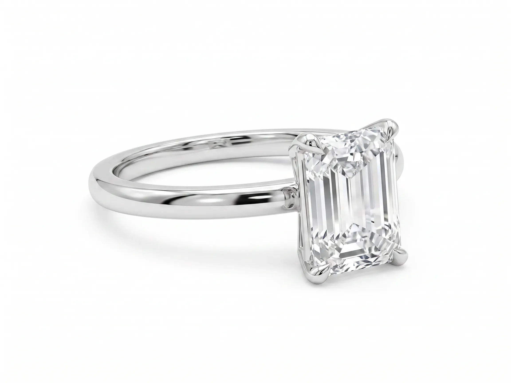 | 00412063 | 祖母绿·单钻 solitário（照片#3) | 1.02 | — | 18K 白金 | 12# | S-WANT0530 | 2,594 | 基础 / 求婚 |
| 2 | 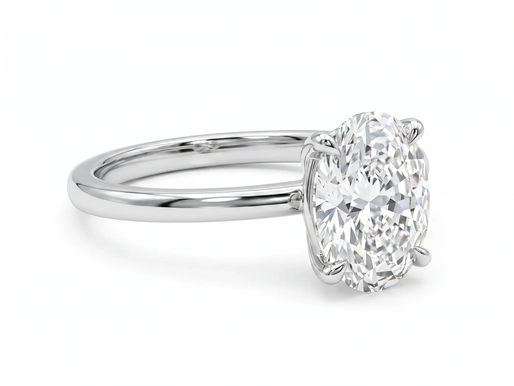 | 00412056 | 椭圆·单钻 solitário（照片#5) | 1.01 | — | 18K 白金 | 11# | S-WANT0522 | 2,805 | 基础+吸睛 / 求婚 |
| 3 | 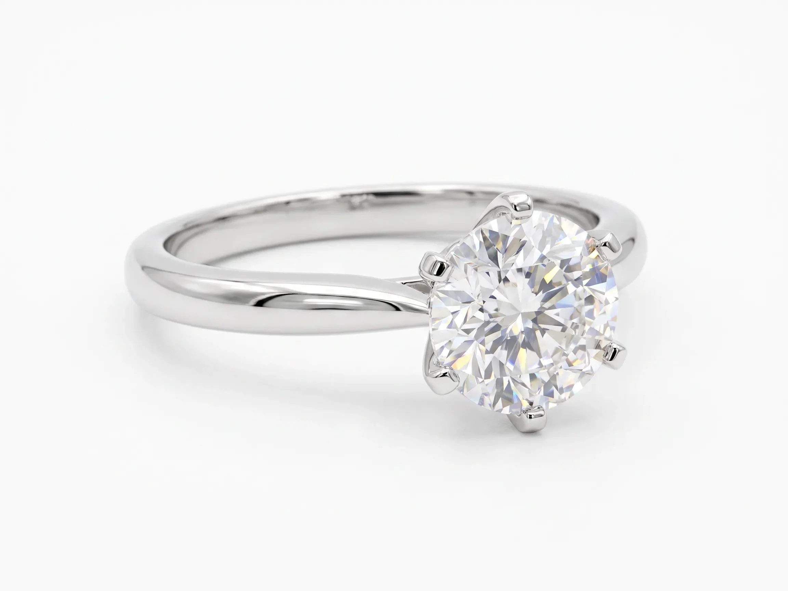 | 00414552 | 圆钻·六爪 solitário（照片#4) | 1.01 | — | Pt950 铂金 | 12# | S-WANT2032 | 2,686 | 基础 / 求婚标杆 |
| 4 | 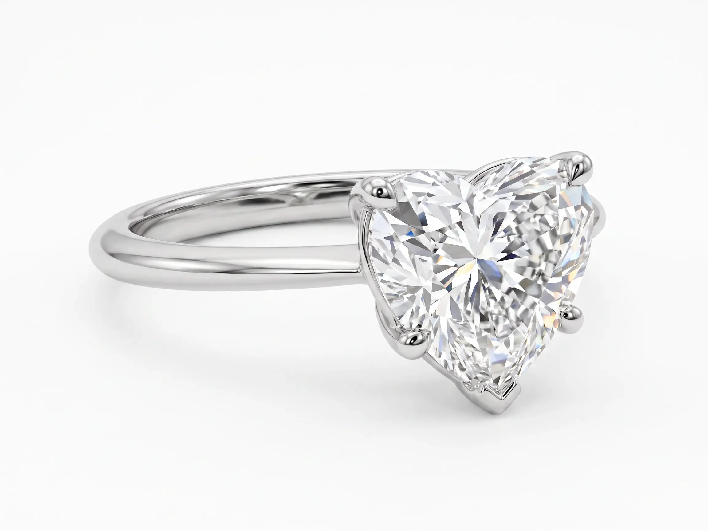 | 00410383 | 心形·solitário（照片#2,D/VVS1) | 1.51 | — | Pt950 铂金 | 11# | S-SBGJY43871 | 3,218 | 求婚 + 悦己 |
| 5 | 未拍照 | 00413584 | 排戒/线戒（满钻 eternity) | — | 0.576/17 | 14K 黄金 | 14# | S-WANT1398 | 1,840 | 叠戴 / aliança |
| 6 | 未拍照 | 00408714 | 排戒/线戒（玫瑰金满钻) | — | 0.872/10 | 18K 玫瑰金 | 12# | TC2250701332 | 2,563 | 叠戴 / aliança |
| 7 | 未拍照 | 00414483 | 排戒/线戒（黄金满钻) | — | 0.395/11 | 18K 黄金 | 13# | TC1760701176 | 1,756 | 叠戴 / aliança |
| | | | | | | | | | **17,462** | |

### 🔹 设计款戒指（8 件 · 小计 ¥31,889）
> 三石、pavé、hidden halo、halo、花形碎钻等有设计感/高毛利款。

| 序 | 图片 | 条码 | 款式（切工·镶嵌） | 主石ct | 副石 ct/粒 | 金属 | 手寸 | 证书号 | 进货价¥ | 定位 |
|---|---|---|---|---|---|---|---|---|---|---|
| 1 | 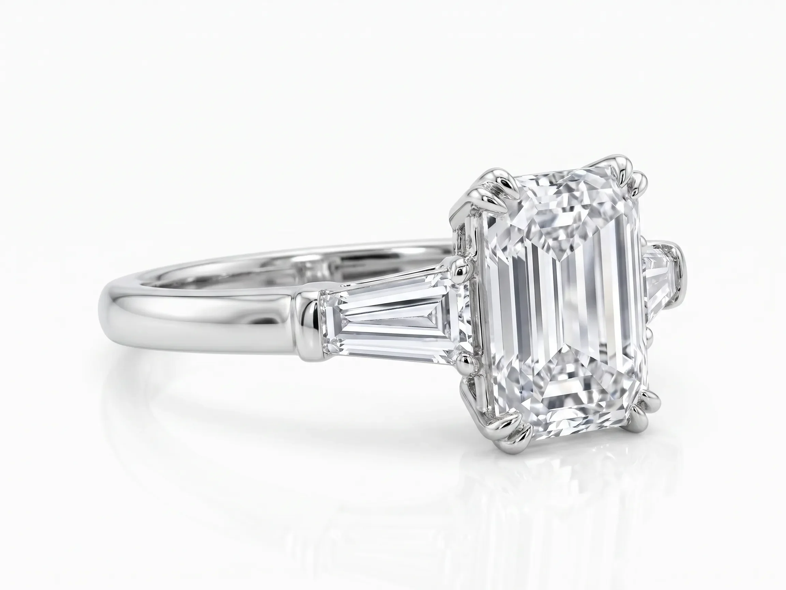 | 00412176 | 祖母绿·三石戒（梯形侧石)（照片#1) | 2.07 | 0.448/2 | 18K 白金 | 14# | S-WANT0596 | 5,408 | 求婚 statement |
| 2 | 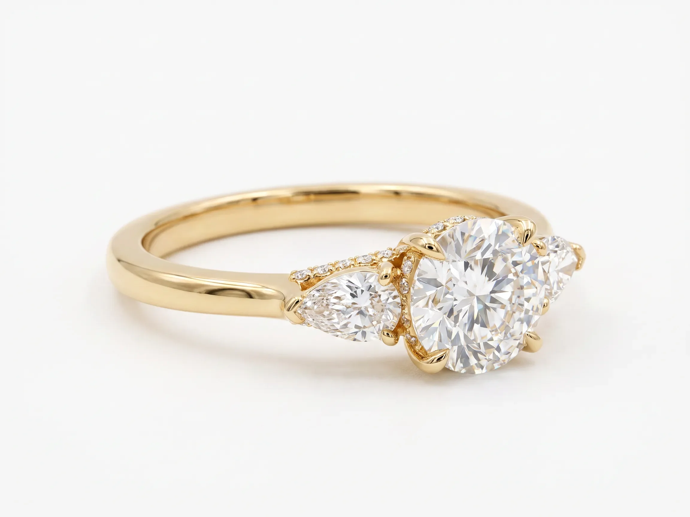 | 00412963 | 三石戒·梨形侧石（照片#10) | 1.00 | 0.380/24 | 18K 黄金 | 12# | S-WANT1044 | 3,371 | 吸睛+定制 / 求婚 |
| 3 | 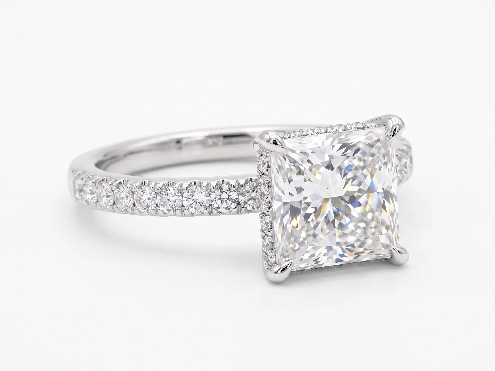 | 00413139 | 公主方·pavé+hidden halo（照片#8) | 1.51 | 0.356/30 | 18K 白金 | 13# | S-WANT1112 | 3,604 | 基础+吸睛 / 求婚 |
| 4 | 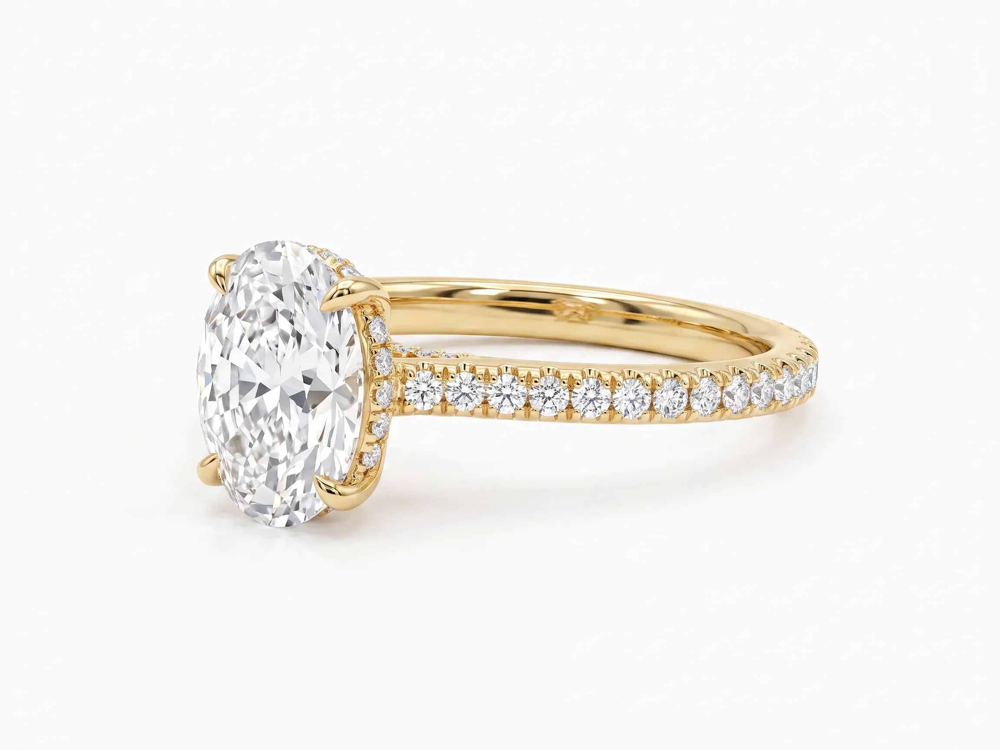 | 00411312 | 椭圆·pavé（hidden halo)（照片#6) | 1.09 | 0.576/133 | 18K 黄金 | 11# | S-WANT0081 | 3,772 | 吸睛+定制 / 求婚 |
| 5 | 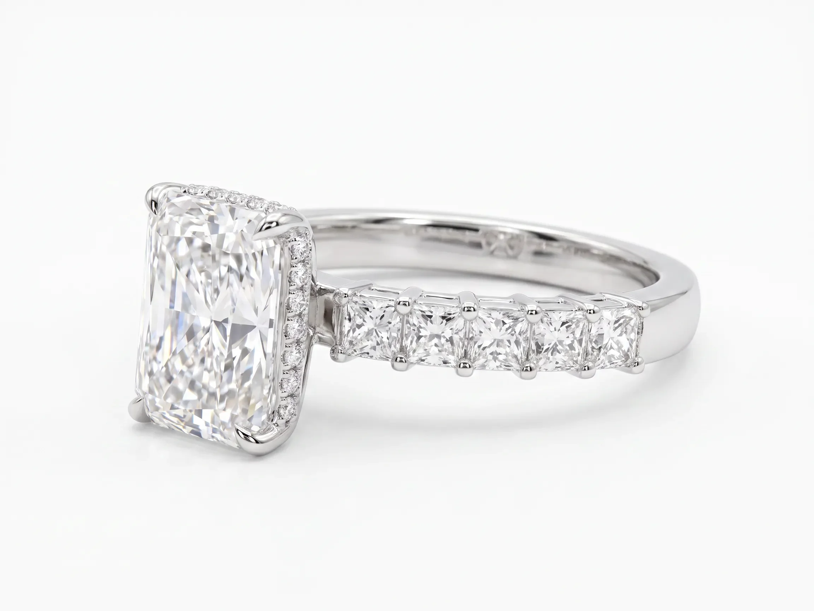 | 00410617 | 雷迪恩·hidden halo+方钻臂（照片#7) | 2.08 | 0.931/34 | Pt950 铂金 | 12# | S-SBGJY44504 | 5,189 | 吸睛+定制 / 求婚 |
| 6 | 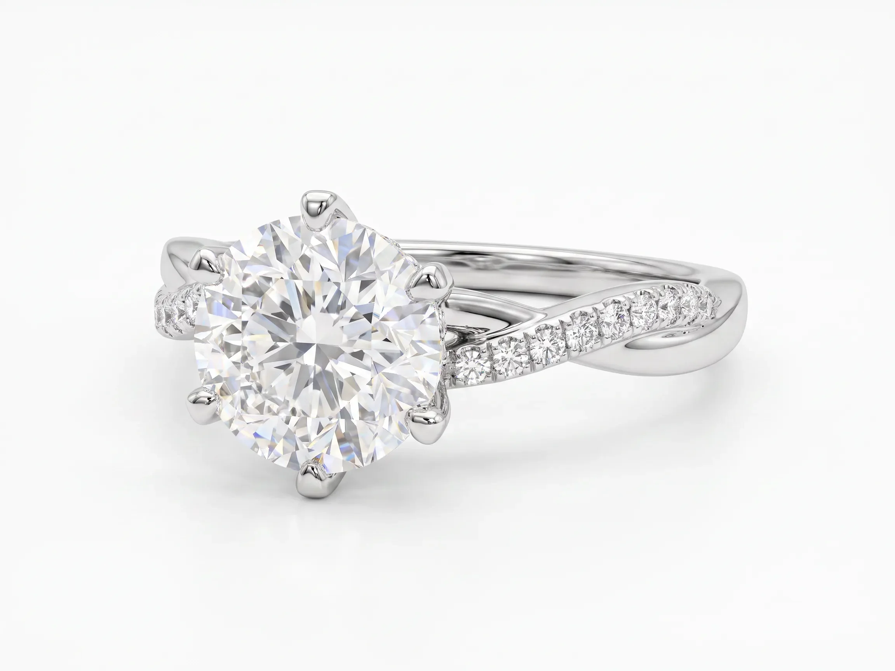 | 00413715 | 圆钻·pavé 臂（照片#9) | 1.01 | 0.157/26 | Pt950 铂金 | 13# | S-WANT1489 | 2,838 | 吸睛 / 求婚 |
| 7 | 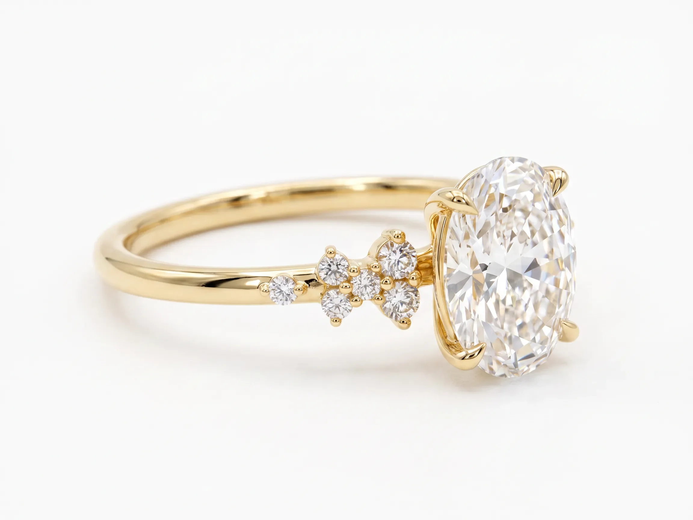 | 00412916 | 椭圆·花形碎钻（秀气)（照片#11) | 1.51 | 0.170/10 | 18K 黄金 | — | S-WANT1007 | 3,978 | 吸睛 / 日常·悦己 |
| 8 |  | 00409798 | 圆钻·Halo 显大款（照片#12) | 1.02 | 0.448/32 | Pt950 铂金 | 12# | S-SBGJY42673 | 3,729 | 吸睛 / 求婚 |
| | | | | | | | | | **31,889** | |

### 🔹 耳饰（0 件 · 小计 ¥0）
> 暂无。**补货优先级 P0**（单钻耳钉 + Huggie 小圈）——见「三、盘点缺口」。

### 🔹 手链（0 件 · 小计 ¥0）
> 暂无。**补货优先级 P0**(网球手链,全行业头号现金牛)——见「三、盘点缺口」。报价参考见 [`深圳水贝成本调研.md`](./深圳水贝成本调研.md) §2.2。

### 🔹 吊坠（2 件 · 小计 ¥3,257）

| 序 | 图片 | 条码 | 款式（切工·镶嵌） | 主石ct | 副石 ct/粒 | 金属 | 手寸 | 证书号 | 进货价¥ | 定位 |
|---|---|---|---|---|---|---|---|---|---|---|
| 1 | 未拍照 | 00414624 | 吊坠（单钻 ponto de luz) | 1.02 | — | Pt950 铂金 | — | S-WANT2081 | 1,255 | 日常线 / 送礼 |
| 2 | 未拍照 | 00412723 | 吊坠（单钻+光环) | 0.83 | 0.680/10 | Pt950 铂金 | — | S-WANT0904 | 2,002 | 日常线 / 送礼 |
| | | | | | | | | | **3,257** | |

> ⚠️ 00412176(设计款戒指序1):创始人口述"附石 0.44/每个",单据为**副石 0.448ct 共 2 粒**(约 0.224/粒),以单据为准。
> 采购成本明细 & 供应商报价见 [`深圳水贝成本调研.md`](./深圳水贝成本调研.md)。

---

## 二、商品图生成记录（Riverflow）

用 Riverflow 以实拍照为 reference 生成白底商品图,**戒指横放平视 + 4:3 横构图**。brand_id / 流程见 [`出图流程与环境配置.md`](./出图流程与环境配置.md)。
**✅ 已批准角度标准(创始人确认)**:每款 3 张 —— `-1` 三分之一侧角(主图)/ `-2` 正面平视 / `-3` 正侧面。

| 条码 | 款式 | 状态 | Riverflow edit/asset ID(-1 / -2 / -3) |
|---|---|---|---|
| 00412063 | 祖母绿单钻 | ✅ 3 角度已生成并下载入库¹ | -1 `2fc726ea-2843-4f0d-b7b1-68dab480a37c` / -2 `43642ce6-0a2c-4d4e-9f56-febbfc450ed4` / -3 `a5222b62-8ece-4d94-a378-380db9541284` |
| 00412056 | 椭圆单钻 | ✅ 3 角度已生成并下载入库 | -1 `86a0f4f7-43b6-46ac-b195-56a8f331783e` / -2 `b381219e-d1ef-4226-9538-e6e37f8a5b6d` / -3 `12ea39fe-73a7-4946-a913-8c320a65bc99` |
| 00414552 | 圆钻六爪 | ✅ 3 角度已生成并下载入库 | -1 `e77a94ca-e4e5-4242-a8a0-590aa68860e1` / -2 `41024a3e-4369-43c0-b851-17a4f0d10d08` / -3 `fead1bb4-43a3-476c-9f91-c1b5b4051b60` |
| 00410383 | 心形单钻 | ✅ 3 角度已生成并下载入库 | -1 `fb287213-0377-4080-aaa1-c1d042c460f0` / -2 `7fcf087d-6574-4aac-933e-7d7a52ab1c13` / -3 `f11ebb55-375d-4c9b-8959-d88012a83a06` |
| 00412176 | 祖母绿三石戒 | ✅ 3 角度已生成并下载入库 | -1 `6208bf74-1655-4637-a576-a59f5c2dee8f` / -2 `daf0d0ea-35e0-4d71-89b8-5227aa70efa6` / -3 `04533760-2db0-4d9f-a0d4-255379b95c5c` |
| 00412963 | 三石·梨形侧石 | ✅ 3 角度已生成并下载入库² | -1 `4dd3b201-178a-4ecd-91e2-78f70adf8673` / -2 `a1b7c465-6f73-4559-9f1a-a2803695154b` / -3 `b3eeefc7-228b-4a59-a5b3-74be9f87bac6` |
| 00413139 | 公主方 pavé+halo | ✅ 3 角度已生成并下载入库 | -1 `749301a9-1bf8-4e04-a8a0-3ad20544cfba` / -2 `d2745f7d-b552-4dab-be02-dec5f7351b7f` / -3 `f49f76d7-dfdf-40d6-983d-6b0733f2f348` |
| 00411312 | 椭圆 pavé | ✅ 3 角度已生成并下载入库 | -1 `a742adf4-c952-4f7c-8dcc-d6ad85105254` / -2 `8dad5a49-aedc-46b4-bfd4-06766b86928c` / -3 `1b9ff9d4-cddc-47d8-8817-08be0276a66d` |
| 00413715 | 圆钻 pavé 臂 | ✅ 3 角度已生成并下载入库 | -1 `c7bfc915-a4ca-4376-9fd7-aa61ac582844` / -2 `70795733-ccf4-4b0d-95ca-0f0662c8d4af` / -3 `2b7a7fe2-0eb0-4af9-9d92-457f9b9a9996` |
| 00410617 | 雷迪恩 hidden halo | ✅ 3 角度已生成并下载入库 | -1 `bf5a1408-31c9-432b-97e4-77dc172b33ed` / -2 `64a3c495-da24-4d6e-8c22-2efd5e33acfc` / -3 `d3e02e47-e0d7-4903-9ebc-6959f9e6d79e` |
| 00412916 | 椭圆花形碎钻 | ✅ 3 角度已生成并下载入库³ | -1 `6e822563-6b3e-41ba-b689-c9b27c3f84de` / -2 `d9c86d48-577f-4f75-8632-989e12f7eeef` / -3 `9ad2304f-e708-4fab-a99a-351005392180` |
| 00409798 | 圆钻 Halo 显大款 | ⏳ 待生成(Drive 暂无实拍原图) | — |

> **生成说明**:以创始人实拍照为**每个角度选取最接近该角度的真图作 source**(有多角度实拍的款优先用真图);受 Riverflow「参考图 + 改比例」限制,4:3 横构图下未叠加多张交叉参考,故真图之外的未见面为 AI 合理推断,非精确实拍。全部 2304×1728(4:3)、白底、戒指横放。
> ¹ **00412063**:仅 1 张顶视实拍,`-3` 为「戒圈正向」目录视角而非严格 90° 正侧面(无真侧图可依)。
> ² **00412963**:`-3` 略偏三分之一侧角,非纯正侧面(可按需重生)。
> ³ **00412916**:Drive 该条码 5 张里有 **2 张实为另一款白金满 halo 椭圆戒(SKU 不符)**,已排除,仅用 3 张匹配的黄金花形款生成——建议核对那 2 张是否属于别的条码。

---

## 三、盘点缺口 & 补货优先级

对照竞品畅销规律([`竞品产品调研.md`](./竞品产品调研.md)),本批 21 件里**成品仍以女款订婚/戒指为主(15 枚戒指)**,**走量珠宝基本空白**:

- ❌ **单钻耳钉 brinco**(全行业引流爆款)—— **优先补**
- ❌ **Huggie 小圈耳环** —— 全行业走量地基
- ❌ **tennis / riviera 手链**(含亲民入门款)—— 头号现金牛
- ⚠️ **小克拉(0.3/0.5ct)** 求婚戒 / 耳钉 —— 用于克拉阶梯与入门价(现有 4 颗裸石 0.31–0.83ct 可配)
- ⚠️ **银托入门款(<R$2,000)** —— 入门引流层

> 补货优先级 **P0:耳钉 → Huggie → 网球手链**;详见 `竞品产品调研.md` 第四节。报价参考已收进 [`深圳水贝成本调研.md`](./深圳水贝成本调研.md)。

---

## 四、物流 / 清关提醒

- 样品出境按**进出口流程正规申报**(NCM 7113、清关代理、税费)—— 对接项目说明书第 5 节,由国内合伙人 + 清关方确认,避免卡关。
- 证书随货同行,入境便于说明货值与真钻属性。
